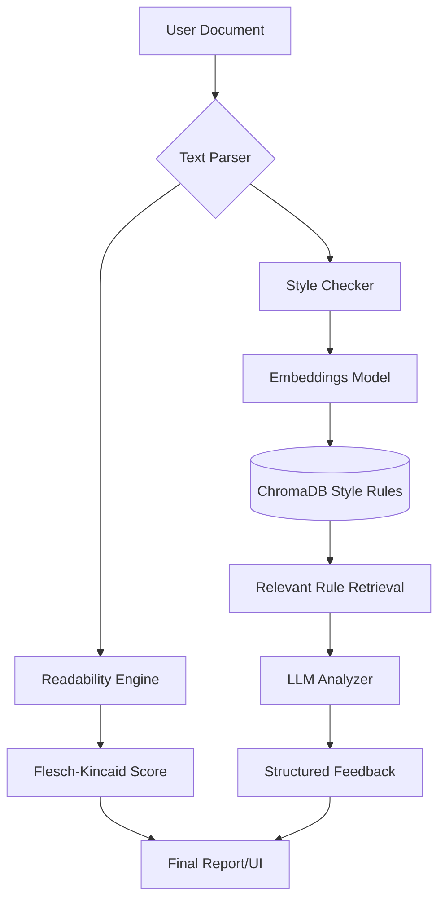

# DocScanner — AI Documentation Reviewer

DocScanner is an AI-powered documentation analysis tool built to automate style guide enforcement, readability checking, and content rewriting in a professional technical writing workflow.

---

## Technical Architecture

DocScanner uses a **Retrieval-Augmented Generation (RAG)** approach to ensure that style checks are grounded in specific company guidelines without overwhelming the LLM context.



---

## Interactive Showcase: Style Enforcement

This tool identifies passive voice, complex sentence structures, and non-imperative steps, providing immediate rewrite suggestions.

=== "Before Review"
    > "The configuration of the system components can be updated by the operator by selecting the internal settings menu which is located in the sidebar."
    
    *   **Issues Found:** Passive voice, sentence length > 25 words, non-imperative structure.

=== "After DocScanner"
    > "Update system components by selecting **Internal Settings** in the sidebar."
    
    *   **Fixes Applied:** Converted to active voice, reduced word count by 65%, used imperative mood.

---

## Key Features

!!! tip "RAG over Static Prompting"
    Instead of sending a massive 50-page style guide to an LLM, DocScanner retrieves only the 3-5 rules relevant to the specific paragraph being analyzed. This reduces token cost and eliminates "hallucinated" rules.

| Feature | Method | Benefit |
| :--- | :--- | :--- |
| **Stylistic Consistency** | Vector Search (RAG) | Matches against corporate style guides in real-time. |
| **Passive Voice Detection** | spaCy Dependency Parsing | Identifies structural issues that standard LLMs often miss. |
| **Readability Metrics** | Flesch-Kincaid / Gunning-Fog | Ensures content matches the target audience's grade level. |

---

## Developer Insight: Flask Blueprints

The engine is built with modularity in mind using Flask blueprints. Each analysis module (style, grammar, readability) is independent, allowing for parallel processing and easier debugging of the rule pipeline.

```python
# Analysis pipeline registration
from modules import style, readability, grammar

app.register_blueprint(style.bp, url_prefix='/api/style')
app.register_blueprint(readability.bp, url_prefix='/api/readability')
app.register_blueprint(grammar.bp, url_prefix='/api/grammar')
```